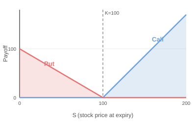

# Chapter 2 — European Option Payoffs

## European vs American Options

A **European option** can only be exercised at expiry — on the exact maturity date $T$, not before. An **American option** can be exercised at any time up to and including $T$.

This course focuses exclusively on European options. The restriction to exercise only at expiry makes the math cleaner and the key ideas more transparent. Everything we build here extends naturally to American options later.

---

## Call Option Payoff

A European **call** gives you the right, but not the obligation, to **buy** the underlying stock at the strike price $K$ on date $T$.

At expiry, the payoff is

$$C_T = \max(S_T - K,\; 0) = (S_T - K)^+$$

::: where
- $C_T$ — call payoff at expiry
- $S_T$ — stock price at expiry
- $K$ — strike price
:::

**How to think about it:**

- If $S_T = 130$ and $K = 100$: you exercise the call, buy the stock at $100, it's worth $130 in the market. Payoff = $30.
- If $S_T = 85$ and $K = 100$: why buy at $100 when the market price is $85? You don't exercise. Payoff = $0.

**The payoff diagram** looks like a hockey stick lying on its side. For stock prices below $K$, the payoff is flat at zero — a horizontal line along the $x$-axis. At $S_T = K$, the line turns upward and rises at a 45-degree angle (slope of 1). The "kink" is at the strike.

---

## Put Option Payoff

A European **put** gives you the right to **sell** the underlying stock at strike price $K$ on date $T$.

At expiry, the payoff is

$$P_T = \max(K - S_T,\; 0) = (K - S_T)^+$$

::: where
- $P_T$ — put payoff at expiry
:::

**Examples:**

- If $S_T = 85$ and $K = 100$: you exercise the put, sell the stock at $100 when it's only worth $85$. Payoff = $15.
- If $S_T = 130$ and $K = 100$: no reason to sell at $100 when the market pays $130. Payoff = $0.

**The payoff diagram** is the mirror image of the call's hockey stick. For stock prices above $K$, the payoff is flat at zero. Below $K$, the payoff rises linearly as the stock price falls. The maximum possible payoff is $K$ (when the stock goes to zero).

---

## Moneyness

Moneyness describes where the current stock price sits relative to the strike.

| Term | Call ($S$ vs $K$) | Put ($S$ vs $K$) | Meaning |
|---|---|---|---|
| **ITM** (in the money) | $S > K$ | $S < K$ | Would have positive payoff if exercised now |
| **ATM** (at the money) | $S \approx K$ | $S \approx K$ | Stock price is near the strike |
| **OTM** (out of the money) | $S < K$ | $S > K$ | Would have zero payoff if exercised now |

**Example.** Stock is at $S = 105$.

- A call with $K = 100$ is **ITM** (you could buy at $100, stock is worth $105).
- A call with $K = 110$ is **OTM** (buying at $110 when stock is $105 is a bad deal).
- A put with $K = 100$ is **OTM** (selling at $100 when stock is $105 — no gain).
- A put with $K = 110$ is **ITM** (selling at $110 when stock is $105 — that's $5 of value).

---

## Intrinsic Value and Time Value

Every option price can be decomposed into two pieces:

$$\text{Option Price} = \text{Intrinsic Value} + \text{Time Value}$$

**Intrinsic value** is the payoff if you could exercise the option right now:

- Call intrinsic value $= \max(S - K, 0)$
- Put intrinsic value $= \max(K - S, 0)$

**Time value** is the remainder — the premium the market charges because *something might happen* between now and expiry that increases the payoff. Time value is always non-negative for European options on non-dividend-paying stocks.

**Example.** $S = 105$, $K = 100$, and a call is trading at $C = 8.50$.

- Intrinsic value $= 105 - 100 = 5.00$
- Time value $= 8.50 - 5.00 = 3.50$

The $3.50 of time value reflects the chance that the stock moves even further above $100 before expiry. As expiry approaches with nothing else changing, time value decays toward zero — this is called **time decay** or **theta decay**.

An OTM option has zero intrinsic value; its entire price is time value.

---

## Profit vs Payoff

When you buy an option, you pay a **premium** upfront. Your profit at expiry is not the raw payoff — you must subtract what you paid:

$$\text{Profit} = \text{Payoff} - \text{Premium Paid}$$

**Example.** You buy a call with $K = 100$ for a premium of $C = 7.00$. At expiry:

| $S_T$ | Payoff $\max(S_T - 100, 0)$ | Profit |
|---|---|---|
| $80$ | $0$ | $-7.00$ |
| $100$ | $0$ | $-7.00$ |
| $107$ | $7$ | $0.00$ (**breakeven**) |
| $120$ | $20$ | $+13.00$ |

The **breakeven** stock price for a long call is $K + C = 100 + 7 = 107$. Below that, you lose money (but never more than the premium). Above that, you profit dollar for dollar with the stock.

For a long put with premium $P$, the breakeven is $K - P$.

---

## No-Arbitrage Bounds on Option Prices

Even without a pricing model, we can establish bounds using a simple principle: **if a strategy costs nothing and sometimes pays off, everyone would do it — so it can't exist.** This is the no-arbitrage principle.

### Call option bounds

$$\max(S - Ke^{-rT},\; 0) \le C \le S$$

::: where
- $C$ — call price today
- $S$ — current stock price
- $r$ — risk-free rate
- $T$ — time to expiry in years
:::

**Upper bound** ($C \le S$): A call gives you the right to buy the stock, so it can never be worth more than the stock itself. If $C > S$, you could sell the call, buy the stock, and pocket the difference with no risk.

**Lower bound** ($C \ge S - Ke^{-rT}$): Consider two portfolios:
- **Portfolio A:** Buy the call for $C$.
- **Portfolio B:** Buy the stock for $S$ and borrow $Ke^{-rT}$ (you will owe $K$ at expiry).

Portfolio B costs $S - Ke^{-rT}$. At expiry, Portfolio B is worth $S_T - K$, which can be negative (if the stock drops). Portfolio A is worth $\max(S_T - K, 0)$, which is always at least as good. So the call must cost at least as much as Portfolio B: $C \ge S - Ke^{-rT}$. And since a price can't be negative, we take $\max$ with zero.

### Put option bounds

$$\max(Ke^{-rT} - S,\; 0) \le P \le Ke^{-rT}$$

::: where
- $P$ — put price today
:::

**Upper bound** ($P \le Ke^{-rT}$): The most a put can ever pay is $K$ (when the stock goes to zero). The present value of that maximum payoff is $Ke^{-rT}$, so the put can't cost more than that.

**Lower bound** ($P \ge Ke^{-rT} - S$): Consider:
- **Portfolio A:** Buy the put for $P$.
- **Portfolio B:** Invest $Ke^{-rT}$ in a risk-free bond (grows to $K$ at expiry) and short-sell the stock (receive $S$ now, owe $S_T$ at expiry).

Portfolio B costs $Ke^{-rT} - S$ and pays $K - S_T$ at expiry. The put pays $\max(K - S_T, 0)$, which is at least as large. So $P \ge Ke^{-rT} - S$, and again we take $\max$ with zero.

---

## Worked Example: Applying the Bounds

**Setup.** $S = 50$, $K = 48$, $r = 0.06$, $T = 0.25$ (3 months).

**Call bounds:**

$$\max(50 - 48e^{-0.06 \times 0.25},\; 0) \le C \le 50$$

$$48 e^{-0.015} = 48 \times 0.9851 = 47.29$$

$$\max(50 - 47.29,\; 0) = 2.71$$

So: $2.71 \le C \le 50$.

**Put bounds:**

$$\max(47.29 - 50,\; 0) \le P \le 47.29$$

$$\max(-2.71,\; 0) = 0$$

So: $0 \le P \le 47.29$.

The call is ITM (stock above strike), so it has a meaningful lower bound. The put is OTM, so its lower bound is just zero.

---

## Practice

::: problem [Computation]
**Problem 2.1.** A European call has strike $K = 60$. At expiry, the stock price is $S_T = 73$. The call was purchased for $C = 5.50$.
(a) What is the payoff?
(b) What is the profit?
(c) A European put with the same strike was purchased for $P = 2.00$. What are the put's payoff and profit?

::: solution
**Solution.**

**(a)** Call payoff $= \max(73 - 60, 0) = 13.00$.

**(b)** Call profit $= 13.00 - 5.50 = 7.50$.

**(c)** Put payoff $= \max(60 - 73, 0) = 0$. Put profit $= 0 - 2.00 = -2.00$. The put expires worthless and the buyer loses the entire premium.
:::
:::

::: problem [Computation]
**Problem 2.2.** A stock trades at $S = 80$. The risk-free rate is $r = 0.04$ and $T = 1$ year. A European call with $K = 75$ is quoted at $C = 3.00$. Show that this price violates the no-arbitrage lower bound and describe the arbitrage trade.

::: solution
**Solution.**

The lower bound for the call is:

$$C \ge \max(S - Ke^{-rT}, 0) = \max(80 - 75e^{-0.04}, 0) = \max(80 - 72.06, 0) = 7.94$$

But the call is quoted at $3.00 < 7.94$. This violates the bound.

**Arbitrage trade:**
1. Buy the call for $3.00.
2. Short-sell the stock, receiving $80.00.
3. Invest $Ke^{-rT} = 72.06$ in the risk-free bond (grows to $75.00$ at expiry).
4. Pocket the remaining cash: $80.00 - 3.00 - 72.06 = 4.94$.

At expiry:
- If $S_T \ge 75$: exercise the call, buy stock at $75$, use it to close the short. Bond pays $75$. Net = $0 + 4.94$ profit locked in.
- If $S_T < 75$: call expires worthless. Use the $75$ from the bond to buy stock in the market at $S_T < 75$ to close the short. You gain $75 - S_T > 0$, plus the $4.94$. Even better.

Either way, you make at least $4.94$ risk-free.
:::
:::

::: problem [Conceptual]
**Problem 2.3.** An OTM call and an OTM put on the same stock (same expiry) both have zero intrinsic value, yet both have positive market prices. Explain where the value comes from and which of the two options has more time value if the stock is at $S = 100$, $K_{\text{call}} = 110$, $K_{\text{put}} = 90$, and both options have the same expiry.

::: solution
**Solution.** Both options are OTM, so their intrinsic values are zero. Their entire market price is **time value** — the premium the market charges for the possibility that the stock moves enough to make the option finish ITM before expiry.

The time value depends on how likely the stock is to cross the strike. With $S = 100$:

- The call needs the stock to rise above $110$ — a $10\%$ move up.
- The put needs the stock to fall below $90$ — a $10\%$ move down.

Under the lognormal model, the distribution of $S_T$ is right-skewed, meaning large upward moves are slightly more probable than equally large downward moves (in absolute dollar terms). However, another factor matters: the drift. If the risk-free rate is positive, the forward price is above $100$, making the upward move to $110$ more reachable than the downward move to $90$.

In practice, with symmetric distance from the current price and positive interest rates, the OTM call typically has slightly more time value than the OTM put. But the exact comparison also depends on volatility and time to expiry.
:::
:::
